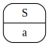
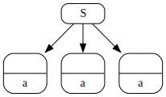
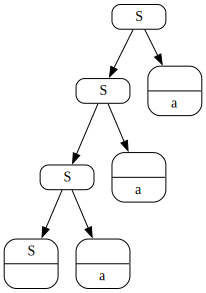
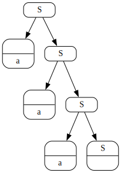
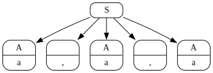
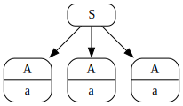

# Zipline: parsing with zippers

This is yet another parser, but with some unique features.

1. **The core algorithm is about 200 lines of code** (excluding extensions and type signatures). Which makes it suitable for learning about parsing and easy to extend (which I did). It is directly taken from the [Parsing with Zippers (Functional Pearl)](https://dl.acm.org/doi/pdf/10.1145/3408990). I recommend to read it - it is quite short and explains algorithm pretty well. Or watch [this video](https://www.youtube.com/watch?v=6Wi-Kc6LDhc).
2. It can handle **left recursion** and **ambiguous grammars**. Which makes it easier to use for newbies. One doesn't need to bend their grammar in order to fit restrictions of an algorithm.
3. Extensions to the core algorithm add ability to **express shape of the desired tree** without need to massage it after parsing. Which makes it trully portable grammar - where is other parsers may need additional augmentation (A in ABNF) in hosting language.
4. Can work with lexer (array of tokens as input) and without (array of chars, or string), so called scannerless parser.

As of now this is rather proof of concept of the idea. Parser works, but it speed is probably not the best.

## Backstory

I was looking for approachable parser. I read couple of papers about parsing and it is quite hard to understand what is happening there.

Then I found [Parsing with Derivatives (A Functional Pearl)](https://matt.might.net/papers/might2011derivatives.pdf). This algorithm was easy to follow. I managed to write [my first parser](https://github.com/stereobooster/parsing-with-derivalives). I learned a lot about parsers and formal grammars. Unfortunately algorithm is quite slow and doesn't produce tree in the shape that I want. I left it there

Later I found another paper [Parsing with Zippers (Functional Pearl)](https://dl.acm.org/doi/pdf/10.1145/3408990), which is the twist to the first paper. It promised to be more performant and I figured I can manipulate tree shape.

So I [started my implementation](https://github.com/stereobooster/zipper). I wanted to build it from the ground up - to make sure I understand every bit. I implemented zippers, I implemented vizualization. Then I started experimenting with different extensions, like Kleene star, negative lookahed, ordered choice. I got carried away a bit.

After all I created small [digital garden about parsing](https://parsing.stereobooster.com/). See:

- [Zipper explanation](https://parsing.stereobooster.com/zipper/)
- [Parsing with zipper playground](https://parsing.stereobooster.com/playground/)

I had an idea about tree shape manipulation and adding PEG operators (negative lookahead, ordered choice) when I was implementing first version of PwZ (back in 2023). But recently I discovered [Instaparse](https://github.com/Engelberg/instaparse) - which has all the same ideas. So I [tried to compile it to JS](https://github.com/stereobooster/instaparsejs). It works. But due to clojure runtime library weight is more than 200kb.

Fast forward to the present day. I decided to write cleaner version from scratch, omit the bits I'm not sure about and publish as a library.

## Grammar

The parser itslef is in the category of interpreters (oposite to parser generators). It's API is based on parser combinators (traditional for functional language parsers). Though DSL (parser combinators) has some caveats - that is why they are not exposed and instead one needs to write grammar to use parser.

Grammar itself is variation of [regular extensions to BNF](https://matt.might.net/articles/grammars-bnf-ebnf/). Or you can call it Chomsky CFG with regular extensions.

Classical BNF (Backus–Naur form):

```
<S> ::= <S> "a" | ""
```

Chomsky CFG (context free grammar):

```
S -> S "a" | ""
```

Grammar used by this library:

```
S = S "a" | ""
```

- ` ` (space) - concatenation
- `|` - unordered choice
- `"a"` - token aka string, terminal, character, lexeme
- `S` - symbol aka variable, non-terminal

And regular extensions (extensions comming from regular expressions)

- `a*` - Kleene star. Any number of `a`
- `a+` - Kleene "plus". One or more `a`
- `a?` - Kleene "question". Zero or one `a`
- `a{...}` - [quantifiers](https://developer.mozilla.org/en-US/docs/Web/JavaScript/Reference/Regular_expressions/Quantifier#description)
- `#"[a-z]"` - regular expression

And tree manipulation extension

- `<a>` - [the same as in instaparse](https://github.com/Engelberg/instaparse#hiding-tags)
- `[a]` - collapse all underlying nodes in one node with all strings concatenated

## Tree-shape manipulation

Simplest example. Grammar: `S = "a"`. Input: `a`



It produces exactly one node with tag `S` and value `a`.

Now let's try sequences (fixed length). Input `aaa`

| `S = "a" "a" "a"`                       | `S = A A A; A = "a"`    | `S = A A A; <A> = "a"`  |
| --------------------------------------- | ----------------------- | ----------------------- |
|                  |  |  |
| Pay attention there are no tags on `a`s |                         |                         |

Sequences unlimited length. Input `aaa`

| `S = S "a" \| ""`       | `S = "a" S \| ""`       | `S = "a"*`              |
| ----------------------- | ----------------------- | ----------------------- |
|  |  |  |

More practical example - delimited list. For example, list of arguments in function call `foo(a,a,a)`. Input: `a,a,a`

| `S = A ("," A)*; A = "a"` | `S = A (<","> A)*; A = "a"` | `S = (A (<","> A)*)?; A = "a"` |
| ------------------------- | --------------------------- | ------------------------------ |
|    |      |         |
|                           |                             | Allows zero items in the list  |

Pay attention how `*` and `<>` allows precisely recreate tree structure without need to explicitly remove some nodes or flatten tree.

## Issues and future improvements

1. There is no reporting for syntax errors. It either can parse or can't, it doesn't give a clue why it can't parse. Which is the biggest pain point right now
2. I want to investigate idea of macros (or functions), like in [Rosie](https://gitlab.com/rosie-pattern-language/rosie/-/blob/master/doc/rpl.md)
3. I wonder if it is possible to implement other operators, like negative lookahead, ordered choice, backreferences, limited negation.
4. What about disambiguation filters?

## TODO

Show full example for JSON.

```
Json = JsonItem
<JsonItem> = Null | True | False | Array | Object | Integer | String
Null = <"n" "u" "l" "l">
True = <"t" "r" "u" "e">
False = <"f" "a" "l" "s" "e">
Array = <"["> (JsonItem (<","> JsonItem)*)? <"]">
Object = <"{"> (KeyValue (<","> KeyValue)*)? <"}">
KeyValue = String <":"> JsonItem
Integer = #"\\d"+
String = <"\""> [#"[^\"]"*] <"\"">
```
